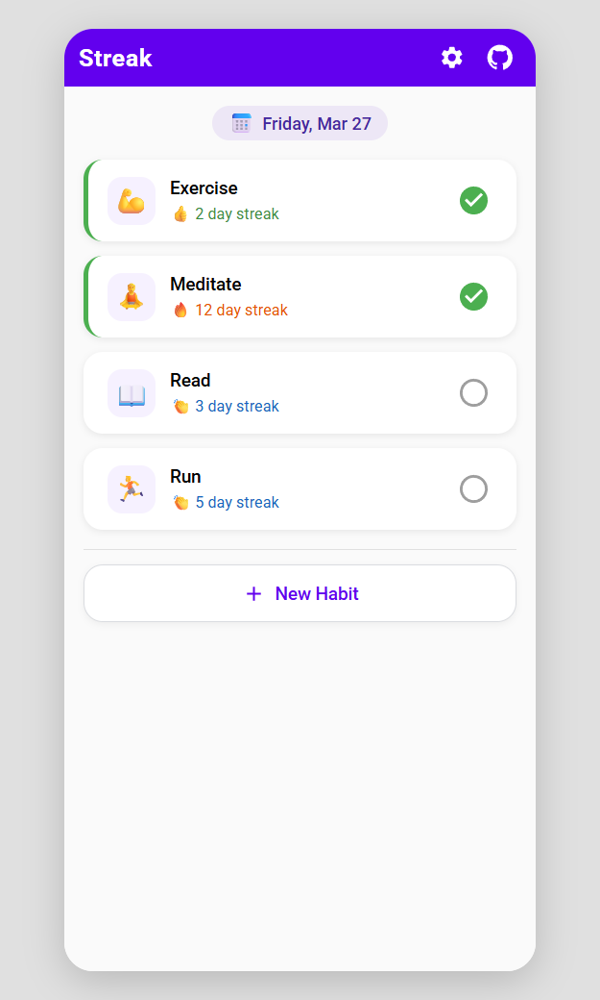
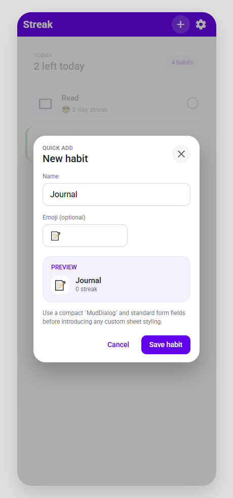
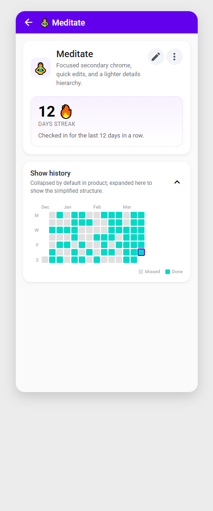
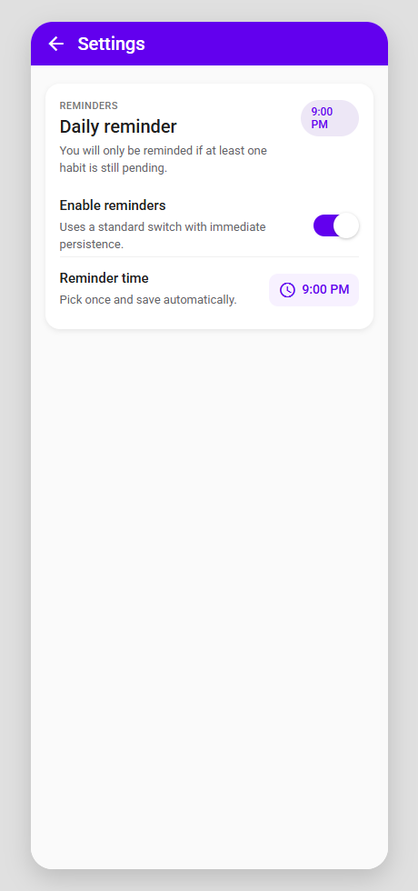

# Streak

[](#current-status)
[](#build-and-run-locally)
[](#run-tests)
[](#tech-stack)

> A lightweight habit-tracking app designed around one idea: make daily check-ins fast enough that you actually keep coming back.

Streak is an indie-SaaS-style mobile app concept for tracking a small set of daily habits, seeing streak momentum at a glance, and keeping the experience intentionally simple.



## Current status

Streak is currently in **active development**.

- Product specs are finalized under [`docs/specs`](docs/specs).
- Interactive HTML mockups are available under [`docs/ui-mockups`](docs/ui-mockups).
- Core UI screens are implemented: Homepage, Habit Details, Quick Add Habit dialog, Edit Habit dialog, Delete Habit dialog, and a compact Settings page with database backup export.
- Local SQLite persistence is wired up with habits and checkins.
- Unit test coverage exists for core services and view models under [`tests/`](tests/).

## Why Streak?

The goal is not to build the biggest habit app. The goal is to build a habit app that feels:

- **Fast** for daily check-ins
- **Calm** instead of over-featured
- **Offline-first** with local device storage
- **Focused** on a maximum of eight habits at a time

If the product direction holds, the primary workflow should feel like: open app, scan progress, tap what you completed, move on with your day.

## Mockup gallery

These screenshots were captured from the current HTML mockups in `docs\ui-mockups`.

### Homepage

The homepage is the main surface of the app: a prominent current-date banner, quick check-ins, direct access to each habit, and a footer `+ New Habit` CTA.


Mockup source: [`docs/ui-mockups/Homepage/index.html`](docs/ui-mockups/Homepage/index.html)

### Quick Add Habit

The quick-add flow keeps habit creation lightweight so new habits can be added from the homepage without interrupting the main workflow.



Mockup source: [`docs/ui-mockups/CreateHabitPage/index.html`](docs/ui-mockups/CreateHabitPage/index.html)

### Habit Details

The habit details experience is focused on streak visibility, inline editing, and a compact history view.



Mockup source: [`docs/ui-mockups/HabitDetailsPage/index.html`](docs/ui-mockups/HabitDetailsPage/index.html)

### Settings

Settings currently keep the database backup flow compact, with a single low-frequency export action and platform-specific save behavior.



Mockup source: [`docs/ui-mockups/SettingsPage/index.html`](docs/ui-mockups/SettingsPage/index.html)

## Product direction

Based on the current specs, Streak is shaping up around the following ideas:

- Daily binary check-ins: done or not done
- A shallow navigation model with **Homepage** as the primary surface
- A hard cap of **8 habits**
- Local-only persistence with no account system
- Simple reminder settings and lightweight data utilities instead of complex automation

For the latest written product direction, start here:

- [`docs/specs/README.md`](docs/specs/README.md)
- [`docs/specs/ui.md`](docs/specs/ui.md)

## Tech stack

The preferred stack for this project is:

- **Frontend:** Blazor WebAssembly-style UI patterns adapted within the app experience
- **UI library:** MudBlazor
- **Mobile app shell:** .NET MAUI / Blazor Hybrid
- **Language/runtime:** .NET 10
- **Data storage:** local SQLite today, with room for future Azure-backed evolution if the product grows

This may continue to evolve as the implementation becomes more concrete.

## Installation

Because the app is still being built, installation is currently closer to **setting up a contributor workstation** than installing a finished product.

1. Install the **.NET 10 SDK**.
2. Install the MAUI workloads you expect to use for local development.
3. Clone this repository.
4. Restore the solution dependencies:

```powershell
dotnet restore .\Streak.slnx
```

5. If you only want to review the planned experience, open the files in `docs\ui-mockups` or browse the screenshots in this README.

## Usage

Today, the most useful way to "use" this repository is to explore the planned product and follow the implementation as it comes together.

Recommended path:

1. Read the product overview in [`docs/specs/README.md`](docs/specs/README.md).
2. Review shared UI guidance in [`docs/specs/ui.md`](docs/specs/ui.md).
3. Open the interactive mockups under [`docs/ui-mockups`](docs/ui-mockups).
4. Use the screenshots in this README as a quick visual overview when sharing the project.

Once the app is fully wired up, the expected end-user flow will be:

- Launch the app
- Review today's progress on the homepage
- Check off completed habits
- Open a habit to inspect streak history
- Adjust reminder preferences in settings

## Build and run locally

Restore everything:

```powershell
dotnet restore .\Streak.slnx
```

Build the repository:

```powershell
dotnet build .\Streak.slnx -c Debug --nologo
```

If you want to validate the Windows UI target specifically:

```powershell
dotnet build --nologo --no-restore .\src\Streak.Ui\Streak.Ui.csproj -f net10.0-windows10.0.19041.0 -p:RuntimeIdentifier=win-x64
```

There is also a convenience script at [`run-local.ps1`](run-local.ps1) that is expected to become the main local entrypoint as the repository matures.

## Run tests

Automated testing is still early, but the repository already has a test project scaffold you can run.

Build the test project:

```powershell
dotnet build .\tests\Streak.Core.UnitTests\Streak.Core.UnitTests.csproj -c Debug --nologo
```

Run the tests:

```powershell
dotnet test .\tests\Streak.Core.UnitTests\Streak.Core.UnitTests.csproj -c Debug --no-build --nologo
```

As implementation expands, this section will be updated to describe the full testing story more accurately.

## Repository structure

```text
.
├── docs
│   ├── specs
│   └── ui-mockups
├── src
├── tests
├── infra
├── run-local.ps1
└── Streak.slnx
```

## Roadmap snapshot

Placeholder roadmap themes for the near term:

- Turn the mockups into implemented UI screens
- Wire up local persistence and check-in behavior
- Add reliable unit and integration coverage
- Tighten the local development workflow
- Replace placeholder badges and sections with real project signals

## Contributing

If you want to contribute while the project is still taking shape:

- Review the specs first
- Keep the implementation aligned with the mockups
- Prefer small, focused pull requests
- Update docs when product direction changes

Additional repo guidance lives in:

- [`CONTRIBUTING.md`](CONTRIBUTING.md)
- [`SECURITY.md`](SECURITY.md)
- [`CODE_OF_CONDUCT.md`](CODE_OF_CONDUCT.md)

---

Built with a healthy amount of optimism, placeholders, and UI-first momentum.
